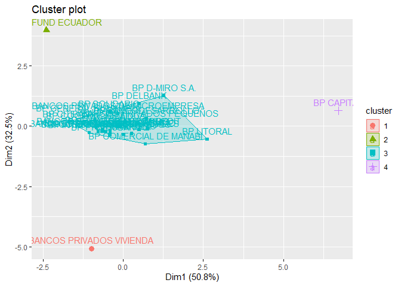

Proyecto 5to modulo
================
Teddy Horacio Alvarez Zarate
2023-09-18

``` r
library(tidyverse)
```

    ## Warning: package 'tidyverse' was built under R version 4.2.3

    ## Warning: package 'ggplot2' was built under R version 4.2.3

    ## Warning: package 'tibble' was built under R version 4.2.3

    ## Warning: package 'tidyr' was built under R version 4.2.3

    ## Warning: package 'readr' was built under R version 4.2.3

    ## Warning: package 'purrr' was built under R version 4.2.3

    ## Warning: package 'dplyr' was built under R version 4.2.3

    ## Warning: package 'forcats' was built under R version 4.2.3

    ## Warning: package 'lubridate' was built under R version 4.2.3

    ## ── Attaching core tidyverse packages ──────────────────────── tidyverse 2.0.0 ──
    ## ✔ dplyr     1.1.3     ✔ readr     2.1.4
    ## ✔ forcats   1.0.0     ✔ stringr   1.5.0
    ## ✔ ggplot2   3.4.3     ✔ tibble    3.2.1
    ## ✔ lubridate 1.9.2     ✔ tidyr     1.3.0
    ## ✔ purrr     1.0.2     
    ## ── Conflicts ────────────────────────────────────────── tidyverse_conflicts() ──
    ## ✖ dplyr::filter() masks stats::filter()
    ## ✖ dplyr::lag()    masks stats::lag()
    ## ℹ Use the conflicted package (<http://conflicted.r-lib.org/>) to force all conflicts to become errors

``` r
library(readxl)
```

    ## Warning: package 'readxl' was built under R version 4.2.3

``` r
setwd("~/Experto en ciencia de datos/Modulo 5/Bases de datos")
bancos <- read_excel("indicadores.xlsx")
```

## Seleccionando los indicadores “Activos productivos/total activos”, “Morosidad cartera total”, “Gastos de operacion/Margen financiero”, “Rentabilidad del ejercicio/activo promedio” y “Fondos disponibles/total depositos corto plazo”

``` r
bancos1 <- bancos%>%filter(`NOMBRE DEL INDICADOR`=="ACTIVOS PRODUCTIVOS / TOTAL ACTIVOS"|`NOMBRE DEL INDICADOR`=="MOROSIDAD DE LA CARTERA TOTAL"|`NOMBRE DEL INDICADOR`=="GASTOS DE OPERACION  / MARGEN FINANCIERO"|`NOMBRE DEL INDICADOR`=="RESULTADOS DEL EJERCICIO / ACTIVO PROMEDIO"|`NOMBRE DEL INDICADOR`=="FONDOS DISPONIBLES / TOTAL DEPOSITOS A CORTO PLAZO")

bancos1 <- bancos1%>%
select(-(`TOTAL BANCOS PRIVADOS`))

bancos1 <- bancos1%>%
gather(`BP GUAYAQUIL`: `BANCOS PRIVADOS DE MICROEMPRESA`, key = "BANCOS", value = "valores")%>%
spread(key = "NOMBRE DEL INDICADOR", value = "valores")
```

## Construya un cluster jerarquico. Grafique y comente su composición, usando al menos 2 distancias y dos métodos de clasificación

``` r
nombres <- bancos1$BANCOS

base <- as.data.frame(scale(bancos1[,-1]))

row.names(base)<- nombres

cluster <- hclust(dist(base, method = "euclidean"), method = "ward.D")

plot(cluster)
```

<!-- -->

``` r
plot(cluster, hang = -0.01, cex=0.8)
```

<!-- -->

``` r
cluster2 <- hclust(dist(base, method = "euclidean"), method = "average")

plot(cluster2, hang = -0.01, cex=0.8)
```

<!-- -->

``` r
par(mfrow=c(1,2))

plot(cluster, hang = -0.01, cex=0.8);plot(cluster2, hang = -0.01, cex=0.8)
```

<!-- -->

### Comparando los dos Gráficos, en el caso de los bancos “Bancos Privados de vivienda”, “Banco Litoral” y “BP Vision Fund de Ecuador” aparecen solos en ambos gráficos, en cambio que “BP Capital” aparece unido a “Bancos Privados de Vivienda” en el grafico izquierdo, en el grafico derecho aparece solo. Sobre el numero de Clusters, en el grafico izquierdo, aparecen 4 clusters y en el grafico izquierdo aparecen 6 clusters

## Determinando a que distancian se encuentran los elementos entre si, y a que grupos pertenecen los elementos y realizando cortes

``` r
distancia <- dist(base, method = "euclidean")

cluster$merge
```

    ##       [,1] [,2]
    ##  [1,]   -1   -4
    ##  [2,]  -20  -25
    ##  [3,]   -3  -29
    ##  [4,]   -5    1
    ##  [5,]   -9  -24
    ##  [6,]   -2    2
    ##  [7,]  -28    4
    ##  [8,]  -26    7
    ##  [9,]   -6  -10
    ## [10,]  -15  -21
    ## [11,]   -8    9
    ## [12,]  -11    6
    ## [13,]  -19   10
    ## [14,]  -23   12
    ## [15,]  -13   13
    ## [16,]  -16  -17
    ## [17,]  -18  -27
    ## [18,]  -14    5
    ## [19,]    8   14
    ## [20,]   11   18
    ## [21,]   17   20
    ## [22,]    3   15
    ## [23,]   19   22
    ## [24,]  -22   16
    ## [25,]   21   24
    ## [26,]  -30   23
    ## [27,]   25   26
    ## [28,]   -7  -12
    ## [29,]   27   28

``` r
cutree(cluster, k=4)
```

    ##     BANCOS PRIVADOS COMERCIALES         BANCOS PRIVADOS CONSUMO 
    ##                               1                               1 
    ## BANCOS PRIVADOS DE MICROEMPRESA         BANCOS PRIVADOS GRANDES 
    ##                               1                               1 
    ##        BANCOS PRIVADOS MEDIANOS        BANCOS PRIVADOS PEQUEÑOS 
    ##                               1                               2 
    ##        BANCOS PRIVADOS VIVIENDA                     BP AMAZONAS 
    ##                               3                               2 
    ##                       BP AUSTRO              BP BANCODESARROLLO 
    ##                               2                               2 
    ##                  BP BOLIVARIANO                      BP CAPITAL 
    ##                               1                               4 
    ##                     BP CITIBANK          BP COMERCIAL DE MANABI 
    ##                               1                               2 
    ##                 BP COOPNACIONAL                  BP D-MIRO S.A. 
    ##                               1                               2 
    ##                      BP DELBANK                        BP FINCA 
    ##                               2                               2 
    ##            BP GENERAL RUMIÑAHUI                    BP GUAYAQUIL 
    ##                               1                               1 
    ##                BP INTERNACIONAL                      BP LITORAL 
    ##                               1                               2 
    ##                         BP LOJA                      BP MACHALA 
    ##                               1                               2 
    ##                     BP PACIFICO                    BP PICHINCHA 
    ##                               1                               1 
    ##                    BP PROCREDIT                   BP PRODUBANCO 
    ##                               2                               1 
    ##                    BP SOLIDARIO           BP VISIONFUND ECUADOR 
    ##                               1                               1

``` r
plot(cluster, hang = -0.01, cex=0.8)
```

<!-- -->

``` r
grupos <- as.data.frame(cutree(cluster, k=4))

library(cluster)

ncluster <- diana(base, metric = "euclidean")

par(mfrow=c(1,2))

plot(ncluster)
```

<!-- -->

``` r
library(devtools)
```

    ## Warning: package 'devtools' was built under R version 4.2.3

    ## Loading required package: usethis

    ## Warning: package 'usethis' was built under R version 4.2.3

``` r
library(factoextra)
```

    ## Warning: package 'factoextra' was built under R version 4.2.3

    ## Welcome! Want to learn more? See two factoextra-related books at https://goo.gl/ve3WBa

``` r
library(fpc)
```

    ## Warning: package 'fpc' was built under R version 4.2.3

``` r
library(cluster)

cluster1 <- hcut(base, k=4, stand = TRUE, hc_metric = "euclidean", hc_method = "ward.D")

fviz_dend(cluster1, rect = TRUE, cex=0.5, k_colors = c("blue", "red", "orange", "brown"))
```

    ## Warning: The `<scale>` argument of `guides()` cannot be `FALSE`. Use "none" instead as
    ## of ggplot2 3.3.4.
    ## ℹ The deprecated feature was likely used in the factoextra package.
    ##   Please report the issue at <https://github.com/kassambara/factoextra/issues>.
    ## This warning is displayed once every 8 hours.
    ## Call `lifecycle::last_lifecycle_warnings()` to see where this warning was
    ## generated.

<!-- -->

## Construya un cluster no jerarquico. Determine el número óptimo de clusters, grafique y comente

``` r
cnj <- kmeans(base,4)
cnj
```

    ## K-means clustering with 4 clusters of sizes 1, 1, 27, 1
    ## 
    ## Cluster means:
    ##   ACTIVOS PRODUCTIVOS / TOTAL ACTIVOS
    ## 1                          -4.9197657
    ## 2                           0.8864937
    ## 3                           0.1704800
    ## 4                          -0.5696881
    ##   FONDOS DISPONIBLES / TOTAL DEPOSITOS A CORTO PLAZO
    ## 1                                         -1.5191883
    ## 2                                          4.6881520
    ## 3                                         -0.1076603
    ## 4                                         -0.2621354
    ##   GASTOS DE OPERACION  / MARGEN FINANCIERO MOROSIDAD DE LA CARTERA TOTAL
    ## 1                              -2.07129500                    -1.0277679
    ## 2                              -0.33611536                    -0.2958488
    ## 3                              -0.07537269                    -0.0999033
    ## 4                               4.44247293                     4.0210057
    ##   RESULTADOS DEL EJERCICIO / ACTIVO PROMEDIO
    ## 1                                -0.64940414
    ## 2                                 2.25115263
    ## 3                                 0.05912119
    ## 4                                -3.19802054
    ## 
    ## Clustering vector:
    ##     BANCOS PRIVADOS COMERCIALES         BANCOS PRIVADOS CONSUMO 
    ##                               3                               3 
    ## BANCOS PRIVADOS DE MICROEMPRESA         BANCOS PRIVADOS GRANDES 
    ##                               3                               3 
    ##        BANCOS PRIVADOS MEDIANOS        BANCOS PRIVADOS PEQUEÑOS 
    ##                               3                               3 
    ##        BANCOS PRIVADOS VIVIENDA                     BP AMAZONAS 
    ##                               1                               3 
    ##                       BP AUSTRO              BP BANCODESARROLLO 
    ##                               3                               3 
    ##                  BP BOLIVARIANO                      BP CAPITAL 
    ##                               3                               4 
    ##                     BP CITIBANK          BP COMERCIAL DE MANABI 
    ##                               3                               3 
    ##                 BP COOPNACIONAL                  BP D-MIRO S.A. 
    ##                               3                               3 
    ##                      BP DELBANK                        BP FINCA 
    ##                               3                               3 
    ##            BP GENERAL RUMIÑAHUI                    BP GUAYAQUIL 
    ##                               3                               3 
    ##                BP INTERNACIONAL                      BP LITORAL 
    ##                               3                               3 
    ##                         BP LOJA                      BP MACHALA 
    ##                               3                               3 
    ##                     BP PACIFICO                    BP PICHINCHA 
    ##                               3                               3 
    ##                    BP PROCREDIT                   BP PRODUBANCO 
    ##                               3                               3 
    ##                    BP SOLIDARIO           BP VISIONFUND ECUADOR 
    ##                               3                               2 
    ## 
    ## Within cluster sum of squares by cluster:
    ## [1]  0.0000  0.0000 36.5473  0.0000
    ##  (between_SS / total_SS =  74.8 %)
    ## 
    ## Available components:
    ## 
    ## [1] "cluster"      "centers"      "totss"        "withinss"     "tot.withinss"
    ## [6] "betweenss"    "size"         "iter"         "ifault"

``` r
cnj$centers
```

    ##   ACTIVOS PRODUCTIVOS / TOTAL ACTIVOS
    ## 1                          -4.9197657
    ## 2                           0.8864937
    ## 3                           0.1704800
    ## 4                          -0.5696881
    ##   FONDOS DISPONIBLES / TOTAL DEPOSITOS A CORTO PLAZO
    ## 1                                         -1.5191883
    ## 2                                          4.6881520
    ## 3                                         -0.1076603
    ## 4                                         -0.2621354
    ##   GASTOS DE OPERACION  / MARGEN FINANCIERO MOROSIDAD DE LA CARTERA TOTAL
    ## 1                              -2.07129500                    -1.0277679
    ## 2                              -0.33611536                    -0.2958488
    ## 3                              -0.07537269                    -0.0999033
    ## 4                               4.44247293                     4.0210057
    ##   RESULTADOS DEL EJERCICIO / ACTIVO PROMEDIO
    ## 1                                -0.64940414
    ## 2                                 2.25115263
    ## 3                                 0.05912119
    ## 4                                -3.19802054

``` r
aggregate(base, by=list(cnj$cluster), FUN = mean)
```

    ##   Group.1 ACTIVOS PRODUCTIVOS / TOTAL ACTIVOS
    ## 1       1                          -4.9197657
    ## 2       2                           0.8864937
    ## 3       3                           0.1704800
    ## 4       4                          -0.5696881
    ##   FONDOS DISPONIBLES / TOTAL DEPOSITOS A CORTO PLAZO
    ## 1                                         -1.5191883
    ## 2                                          4.6881520
    ## 3                                         -0.1076603
    ## 4                                         -0.2621354
    ##   GASTOS DE OPERACION  / MARGEN FINANCIERO MOROSIDAD DE LA CARTERA TOTAL
    ## 1                              -2.07129500                    -1.0277679
    ## 2                              -0.33611536                    -0.2958488
    ## 3                              -0.07537269                    -0.0999033
    ## 4                               4.44247293                     4.0210057
    ##   RESULTADOS DEL EJERCICIO / ACTIVO PROMEDIO
    ## 1                                -0.64940414
    ## 2                                 2.25115263
    ## 3                                 0.05912119
    ## 4                                -3.19802054

``` r
fviz_cluster(cnj, data = base)
```

<!-- -->

### Determinando el numero optimo de clusters

``` r
library(NbClust)

clusteroptimo <- NbClust(base, distance = "euclidean", min.nc = 4,
                         max.nc = 6, method = "ward.D", index="all")
```

<!-- -->

    ## *** : The Hubert index is a graphical method of determining the number of clusters.
    ##                 In the plot of Hubert index, we seek a significant knee that corresponds to a 
    ##                 significant increase of the value of the measure i.e the significant peak in Hubert
    ##                 index second differences plot. 
    ## 

<!-- -->

    ## *** : The D index is a graphical method of determining the number of clusters. 
    ##                 In the plot of D index, we seek a significant knee (the significant peak in Dindex
    ##                 second differences plot) that corresponds to a significant increase of the value of
    ##                 the measure. 
    ##  
    ## ******************************************************************* 
    ## * Among all indices:                                                
    ## * 3 proposed 4 as the best number of clusters 
    ## * 16 proposed 5 as the best number of clusters 
    ## * 4 proposed 6 as the best number of clusters 
    ## 
    ##                    ***** Conclusion *****                            
    ##  
    ## * According to the majority rule, the best number of clusters is  5 
    ##  
    ##  
    ## *******************************************************************

### De acuerdo al calculo del numero optimo de clusters, este debe ser de 5 lo cual difiere en 1 con el calculo de cluster por el metodo de cluster jerarquico
